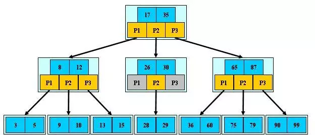

# B树

Balance Tree - 平衡树. 它是一颗多路平衡查找树. 其查找的时间复杂度是 O(lgN), 与数的深度相关. B-Tree 的产生与[外部存储器-磁盘的访问方式][1]有关. 采用二叉查找树时, 最坏的情况下, 磁盘 I/O 次数等于树的深度. B-Tree 采用多叉方式主要是为了降低树的高度.

## 概念和定义

* 阶数: 表示了一个节点最多有多少个子节点. 一般用 m 表示.
* 一颗 m 阶的 B-Tree [定义][5]:
  * 每个节点最多有 m 个子节点
  * 每个非叶子节点(除根节点)最少有 ceil(m/2) 个关键字. ceil(m/2) 是指上取整.
  * 如果根节点不是叶子节点, 那么它**至少有两个**子节点.
  * 有 k 个子节点的非叶子节点拥有 k-1 个关键字. 每个节点中的关键字都按照从小到大的顺序排列, 每个关键字的左子树中的所有关键字都小于它, 而右子树中的所有关键字都大于它.
  * 所有叶子节点都位于同一层, 或者说根节点到每个叶子节点的距离都相同.

## 操作

### 查询

1. 从根节点开始查找.
2. 将查找的 Key 和 当前节点的关键字 K[0, 1, 2 ...] 依次比较, Key < Kn 时, 查找左子树, Key > Kn 时, 查找右子树

## 插入

插入一条记录, 即插入一个键值对. 如果 B-Tree 中, 已经存在需要插入的键, 更新其值. 如果不存在将插入的键, 则在**叶子节点**中进行插入操作.

1. 根据将插入的键找到叶子节点上的插入位置.
2. 叶子节点 key 的个数 < m-1 (m 为阶数) 时按左小右大的顺序插入. 否则, 进入步骤 3, 进行分裂重建.
3. 以节点中间的 key 为中心分裂为左右两部分, 然后将这个中间的 key 插入到父节点中. 这个 key 的左子树指向分裂后的左半部分, 这个 key 的右子树指向分裂后的右半部分, 然后将当前节点指向父节点, 递归进行分裂操作, 直到父节点无需分裂或根节点分裂完成.

在实现B树的代码中，为了使代码编写更加容易，我们可以将结点中存储记录的数组长度定义为m而非m-1，这样方便底层的结点由于分裂向上层插入一个记录时，上层有多余的位置存储这个记录。同时，每个结点还可以存储它的父结点的引用，这样就不必编写递归程序。

一般来说，对于确定的m和确定类型的记录，结点大小是固定的，无论它实际存储了多少个记录。但是分配固定结点大小的方法会存在浪费的情况，比如key为28,29所在的结点，还有2个key的位置没有使用，但是已经不可能继续在插入任何值了，因为这个结点的前序key是27,后继key是30,所有整数值都用完了。所以如果记录先按key的大小排好序，再插入到B树中，结点的使用率就会很低，最差情况下使用率仅为50%。

## 删除

从 B-Tree 中删除一个关键字和其对应的值. 删除操作需要 O(h) 次磁盘操作。所需CPU时间为 O(th)=O(tlogtn) 。
删除过程可以参考[算法导论18章][2]
B-TREE-DELETE( x, k ) 过程(下面的 t = ceil(m/2)):

1. 如果关键字 k 有可能在结点 x 中，并且 x 是**叶结点**，则从 x 中删除 k 。
2. 如果关键字 k 在结点 x 中，并且 x 是内部结点，则做一下操作：
  a. 如果节点 x 中前于 k 的子节点 y 包含至少 t 个关键字, 则找出 k 在以 y 为根的子树中的前驱 k' .递归的删除 k' , 并在 x 中用 k' 取代 k .(找到 k' 并删除它可以在沿树下降的一趟过程中完成.)
  b. 对称地, 如果节点 x 中位于 k 之后的子节点 z 包含至少 t 个关键字, 则找出 k 在以 z 为根的子树中的后继 k' . 递归的删除 k' , 并在 x 中用 k' 取代 k. (找到 k' 并删除它可以在沿树下降的一趟过程中完成.)
  c. 否则, 如果 y 和 z 都只有 t-1 个关键字, 则将 k 和 z 中所有关键字合并进 y , 使得 x 失去 k 和指向 z 的指针, 这使 y 包含 2t-1 个关键字. 然后, 释放 z 并将 k 从 y 中删除.
3. 如果关键字 k 当前不在内部结点 x 中，则确定可能包含 k 的子树的根 ci(如果 k 确实在树中的话) 。如果 ci 只有 t−1 个关键字, 必须执行步骤 3a 或 3b 来保证降至一个至少包含 t 个关键字的结点。然后通过对 x 的某个合适的子结点进行递归而结束。
  a. 如果 ci 只有 t−1 个关键字，但是它的一个相邻的兄弟至少包含 t 个关键字，则将 x 中的某个关键字降至 ci 中, 将 ci 的相邻左兄弟或右兄弟中的某一个关键字升至 x 将该兄弟中合适的子女指针移到 ci 中，这样 ci 就多了一个关键字。
  b. 如果 ci 以及 ci 的所有相邻兄弟都只包含 t−1 个关键字，则将 ci 与一个兄弟合并。(即将 ci 旁边的一个关键字下推，合并到新结点，成为中间关键字)

, , 这个好理解点

## b+tree

b+tree 是 b-tree 的变体. 它通过最大化在每个内部节点内的子节点的数目(只有叶子节点存储数据. 相同资源情况下, b+tree 可以比 b-tree 建立更多的非叶子节点)减少树的高度. 它和 b-tree 区别是:

区别 | b-tree | b+tree | 备注
---- | ---- | ----
所有关键字和数据都出现在叶子节点 | 否 | 是 | b-tree 非叶子节点存储数据; b+tree **只有**叶子节点存储数据
非叶子节点的子树个数与关键字个数的关系 | 子树个数 = 关键字个数 + 1 | 相等 |
叶子节点是否有指针链 | 否 | 是 |

## 参考

* [B树和B+树的插入、删除图文详解][3]
* [平衡二叉树、B树、B+树、B*树][4]

[1]: <https://github.com/julycoding/The-Art-Of-Programming-By-July/blob/master/ebook/zh/03.02.md> "B树"
[2]: <https://blog.csdn.net/rsy56640/article/details/80143516> "算法导论 - 18.3 从B树中删除关键字"
[3]: <https://www.cnblogs.com/nullzx/p/8729425.html> "B树和B+树的插入、删除图文详解"
[4]: <https://zhuanlan.zhihu.com/p/27700617> "B树、B+树、B*树 区别与总结"
[5]: <https://zh.wikipedia.org/wiki/B%E6%A0%91> "B树"
